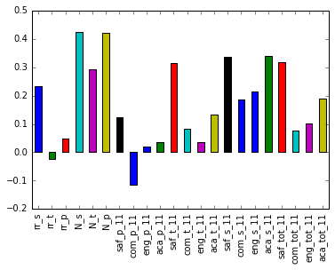
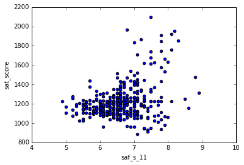
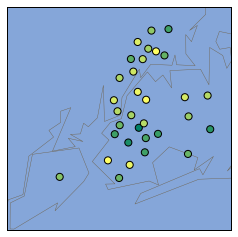
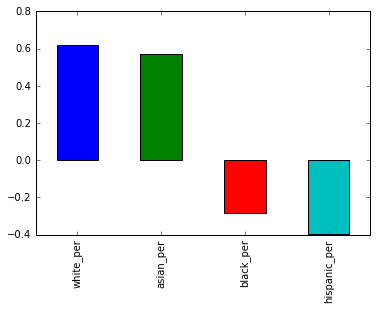
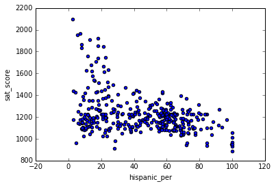
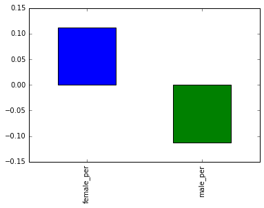

# Read in the data


```python
import pandas as pd
import numpy
import re

data_files = [
    "ap_2010.csv",
    "class_size.csv",
    "demographics.csv",
    "graduation.csv",
    "hs_directory.csv",
    "sat_results.csv"
]

data = {}

for f in data_files:
    d = pd.read_csv("schools/{0}".format(f))
    data[f.replace(".csv", "")] = d
```

# Read in the surveys


```python
all_survey = pd.read_csv("schools/survey_all.txt", delimiter="\t", encoding='windows-1252')
d75_survey = pd.read_csv("schools/survey_d75.txt", delimiter="\t", encoding='windows-1252')
survey = pd.concat([all_survey, d75_survey], axis=0)

survey["DBN"] = survey["dbn"]

survey_fields = [
    "DBN", 
    "rr_s", 
    "rr_t", 
    "rr_p", 
    "N_s", 
    "N_t", 
    "N_p", 
    "saf_p_11", 
    "com_p_11", 
    "eng_p_11", 
    "aca_p_11", 
    "saf_t_11", 
    "com_t_11", 
    "eng_t_11", 
    "aca_t_11", 
    "saf_s_11", 
    "com_s_11", 
    "eng_s_11", 
    "aca_s_11", 
    "saf_tot_11", 
    "com_tot_11", 
    "eng_tot_11", 
    "aca_tot_11",
]
survey = survey.loc[:,survey_fields]
data["survey"] = survey
```

# Add DBN columns


```python
data["hs_directory"]["DBN"] = data["hs_directory"]["dbn"]

def pad_csd(num):
    string_representation = str(num)
    if len(string_representation) > 1:
        return string_representation
    else:
        return "0" + string_representation
    
data["class_size"]["padded_csd"] = data["class_size"]["CSD"].apply(pad_csd)
data["class_size"]["DBN"] = data["class_size"]["padded_csd"] + data["class_size"]["SCHOOL CODE"]
```

# Convert columns to numeric


```python
cols = ['SAT Math Avg. Score', 'SAT Critical Reading Avg. Score', 'SAT Writing Avg. Score']
for c in cols:
    data["sat_results"][c] = pd.to_numeric(data["sat_results"][c], errors="coerce")

data['sat_results']['sat_score'] = data['sat_results'][cols[0]] + data['sat_results'][cols[1]] + data['sat_results'][cols[2]]

def find_lat(loc):
    coords = re.findall("\(.+, .+\)", loc)
    lat = coords[0].split(",")[0].replace("(", "")
    return lat

def find_lon(loc):
    coords = re.findall("\(.+, .+\)", loc)
    lon = coords[0].split(",")[1].replace(")", "").strip()
    return lon

data["hs_directory"]["lat"] = data["hs_directory"]["Location 1"].apply(find_lat)
data["hs_directory"]["lon"] = data["hs_directory"]["Location 1"].apply(find_lon)

data["hs_directory"]["lat"] = pd.to_numeric(data["hs_directory"]["lat"], errors="coerce")
data["hs_directory"]["lon"] = pd.to_numeric(data["hs_directory"]["lon"], errors="coerce")
```

# Condense datasets


```python
class_size = data["class_size"]
class_size = class_size[class_size["GRADE "] == "09-12"]
class_size = class_size[class_size["PROGRAM TYPE"] == "GEN ED"]

class_size = class_size.groupby("DBN").agg(numpy.mean)
class_size.reset_index(inplace=True)
data["class_size"] = class_size

data["demographics"] = data["demographics"][data["demographics"]["schoolyear"] == 20112012]

data["graduation"] = data["graduation"][data["graduation"]["Cohort"] == "2006"]
data["graduation"] = data["graduation"][data["graduation"]["Demographic"] == "Total Cohort"]
```

# Convert AP scores to numeric


```python
cols = ['AP Test Takers ', 'Total Exams Taken', 'Number of Exams with scores 3 4 or 5']

for col in cols:
    data["ap_2010"][col] = pd.to_numeric(data["ap_2010"][col], errors="coerce")
```

# Combine the datasets


```python
combined = data["sat_results"]

combined = combined.merge(data["ap_2010"], on="DBN", how="left")
combined = combined.merge(data["graduation"], on="DBN", how="left")

to_merge = ["class_size", "demographics", "survey", "hs_directory"]

for m in to_merge:
    combined = combined.merge(data[m], on="DBN", how="inner")

combined = combined.fillna(combined.mean())
combined = combined.fillna(0)
```

# Add a school district column for mapping


```python
def get_first_two_chars(dbn):
    return dbn[0:2]

combined["school_dist"] = combined["DBN"].apply(get_first_two_chars)
```

# Find correlations


```python
correlations = combined.corr()
correlations = correlations["sat_score"]
print(correlations)
```

    SAT Critical Reading Avg. Score         0.986820
    SAT Math Avg. Score                     0.972643
    SAT Writing Avg. Score                  0.987771
    sat_score                               1.000000
    AP Test Takers                          0.523140
    Total Exams Taken                       0.514333
    Number of Exams with scores 3 4 or 5    0.463245
    Total Cohort                            0.325144
    CSD                                     0.042948
    NUMBER OF STUDENTS / SEATS FILLED       0.394626
    NUMBER OF SECTIONS                      0.362673
    AVERAGE CLASS SIZE                      0.381014
    SIZE OF SMALLEST CLASS                  0.249949
    SIZE OF LARGEST CLASS                   0.314434
    SCHOOLWIDE PUPIL-TEACHER RATIO               NaN
    schoolyear                                   NaN
    fl_percent                                   NaN
    frl_percent                            -0.722225
    total_enrollment                        0.367857
    ell_num                                -0.153778
    ell_percent                            -0.398750
    sped_num                                0.034933
    sped_percent                           -0.448170
    asian_num                               0.475445
    asian_per                               0.570730
    black_num                               0.027979
    black_per                              -0.284139
    hispanic_num                            0.025744
    hispanic_per                           -0.396985
    white_num                               0.449559
                                              ...   
    rr_p                                    0.047925
    N_s                                     0.423463
    N_t                                     0.291463
    N_p                                     0.421530
    saf_p_11                                0.122913
    com_p_11                               -0.115073
    eng_p_11                                0.020254
    aca_p_11                                0.035155
    saf_t_11                                0.313810
    com_t_11                                0.082419
    eng_t_11                                0.036906
    aca_t_11                                0.132348
    saf_s_11                                0.337639
    com_s_11                                0.187370
    eng_s_11                                0.213822
    aca_s_11                                0.339435
    saf_tot_11                              0.318753
    com_tot_11                              0.077310
    eng_tot_11                              0.100102
    aca_tot_11                              0.190966
    grade_span_max                               NaN
    expgrade_span_max                            NaN
    zip                                    -0.063977
    total_students                          0.407827
    number_programs                         0.117012
    priority08                                   NaN
    priority09                                   NaN
    priority10                                   NaN
    lat                                    -0.121029
    lon                                    -0.132222
    Name: sat_score, Length: 67, dtype: float64


# Plotting survey correlations


```python
# Remove DBN since it's a unique identifier, not a useful numerical value for correlation.
survey_fields.remove("DBN")
```


```python
%matplotlib inline
combined.corr()["sat_score"][survey_fields].plot.bar()
```


    <matplotlib.axes._subplots.AxesSubplot at 0x7f571af6d5c0>





From the bar graph, we can see that the variables which have the highest correlation with SAT score are N_s and N_p

# Safety

Both saf_t_11 and saf_s_11, which measure how safe teachers and students respectively feel at school correlate highlu with SAT score. I wish to investigate this relationship further. 


```python
combined.plot.scatter("saf_s_11", "sat_score")
```


    <matplotlib.axes._subplots.AxesSubplot at 0x7f571afd1b00>





The correlation between student safety vs sat_score appears present but weak. 

I will now map out safety scores by district. 


```python
from mpl_toolkits.basemap import Basemap
import matplotlib.pyplot as plt

districts = combined.groupby("school_dist").agg(numpy.mean)
districts.reset_index(inplace=True)

m = Basemap(
    projection='merc', 
    llcrnrlat=40.496044, 
    urcrnrlat=40.915256, 
    llcrnrlon=-74.255735, 
    urcrnrlon=-73.700272,
    resolution='i'
)

m.drawmapboundary(fill_color='#85A6D9')
m.drawcoastlines(color='#6D5F47', linewidth=.4)
m.drawrivers(color='#6D5F47', linewidth=.4)

longitudes = districts["lon"].tolist()
latitudes = districts["lat"].tolist()
m.scatter(longitudes, latitudes, s=50, zorder=2, latlon=True, c=districts["saf_s_11"], cmap="summer")
plt.show()
```





We can see that specific areas are associated with different safety scores. 

# Influence of Race

I now want to look to see whether there are any racial differences in SAT performance. 


```python
races = ["white_per", "asian_per", "black_per", "hispanic_per"]
combined.corr()["sat_score"][races].plot.bar()
```


    <matplotlib.axes._subplots.AxesSubplot at 0x7f5718e80898>





There seems to be some correlations. White and Asian races are positively correlated with SAT scores, while Blank and Hispanic populations are negatively correlated. 

I now want to explore schools with lot SAT scores and a high Hispanic population. 


```python
combined.plot.scatter("hispanic_per", "sat_score")
```


    <matplotlib.axes._subplots.AxesSubplot at 0x7f5718dc0780>





I will now research schools with a Hispanic population of greater than 95%


```python
name = combined[combined["hispanic_per"] > 95]["SCHOOL NAME"]
print(name)
```

    44                         MANHATTAN BRIDGES HIGH SCHOOL
    82      WASHINGTON HEIGHTS EXPEDITIONARY LEARNING SCHOOL
    89     GREGORIO LUPERON HIGH SCHOOL FOR SCIENCE AND M...
    125                  ACADEMY FOR LANGUAGE AND TECHNOLOGY
    141                INTERNATIONAL SCHOOL FOR LIBERAL ARTS
    176     PAN AMERICAN INTERNATIONAL HIGH SCHOOL AT MONROE
    253                            MULTICULTURAL HIGH SCHOOL
    286               PAN AMERICAN INTERNATIONAL HIGH SCHOOL
    Name: SCHOOL NAME, dtype: object


According to a quick Wikipedia search, the first few schools above are primarily be geared towards recent immigrants.

I will now look at schools with a Hispanic population less than 10% and SAT scores greater than 1800 


```python
name = combined[(combined["hispanic_per"] < 10) & (combined["sat_score"] > 1800)]["SCHOOL NAME"]
print(name)
```

    37                                STUYVESANT HIGH SCHOOL
    151                         BRONX HIGH SCHOOL OF SCIENCE
    187                       BROOKLYN TECHNICAL HIGH SCHOOL
    327    QUEENS HIGH SCHOOL FOR THE SCIENCES AT YORK CO...
    356                  STATEN ISLAND TECHNICAL HIGH SCHOOL
    Name: SCHOOL NAME, dtype: object


According to a quick Wikipedia search, many of the schools above specialize in STEM. I am unsure as to why they have such low Hispanic populations. 

# Gender

Let's now look at the effects of gender on SAT scores. 


```python
combined.corr()["sat_score"][["female_per", "male_per"]].plot.bar()
```


    <matplotlib.axes._subplots.AxesSubplot at 0x7f5718e2fda0>





It appears that females perform better on the SAT than males. 

I will now focus on schools with a high percentage of females. 


```python
combined.plot.scatter("female_per", "sat_score")
```


    <matplotlib.axes._subplots.AxesSubplot at 0x7f5718c99550>


This is one odd graph. I see a very weak correlation. I do want to look at a cluster of schools with a high percentage of females (60 to 80), and high SAT scores.


```python
schools = combined[(combined["female_per"] > 60) & (combined["sat_score"] > 1700)]["SCHOOL NAME"]
schools
```


    5                         BARD HIGH SCHOOL EARLY COLLEGE
    26                         ELEANOR ROOSEVELT HIGH SCHOOL
    60                                    BEACON HIGH SCHOOL
    61     FIORELLO H. LAGUARDIA HIGH SCHOOL OF MUSIC & A...
    302                          TOWNSEND HARRIS HIGH SCHOOL
    Name: SCHOOL NAME, dtype: object


A quick Wikipedia search tells me that these schools seem quite selective. 

# AP Scores

I now wish to look at the correlation between AP scores and SAT scores. I will look at the percentage of students in each school who took at least on AP exam


```python
combined["ap_per"] = combined["AP Test Takers "] / combined["total_enrollment"]

combined.plot.scatter("ap_per", "sat_score")
```


    <matplotlib.axes._subplots.AxesSubplot at 0x7f5718e5c278>


```python
I see another weak correlation here. 
```
